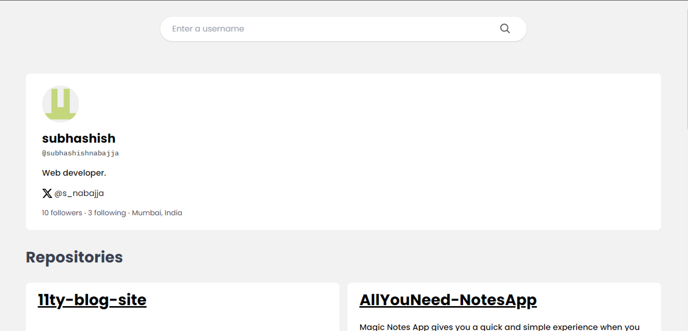

## Fyle Internship Assignment

> You can check out the application by visiting [Github User Search.](https://githubusersearchfyle.netlify.app/)

### Introduction

This is my implementation of Github user search web application based on the Angular Framework. The styling is done with `Tailwind Css` as mentioned in the rule.

### Working

The application is simple it works by consuming the `Github`'s REST API. The application uses the API in an unauthenticated manner and hence it's prone to rate limiting. To increase the rate limit we can use the authenticated API calls.

The application also makes use of the `CacheStorage` API to store the requests in the cache and hence recovers data from the cache on subsequent request.

Paginaition is implmented using the `NgxPagination` package. Also the skeleton loading animations are implemented using the `NgxSkeletonLoader` package. All though these techniques can be implemented directly in `Angular`, but these using these package enable efficient development and produces much polished application.

### Unit tests

As mentioned in the assignment, there are unit test written for 1 `component` and 1 `service`. These "tests" tests various aspects of the application.
